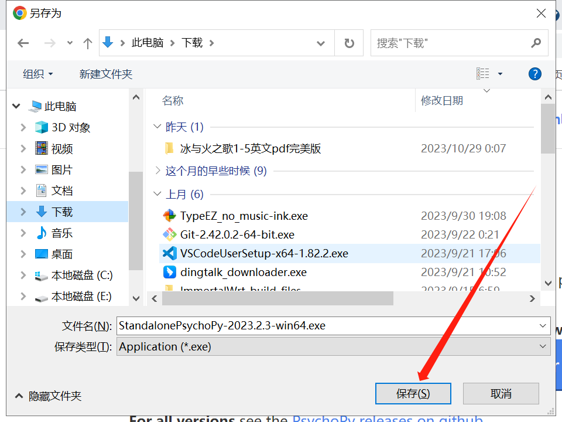
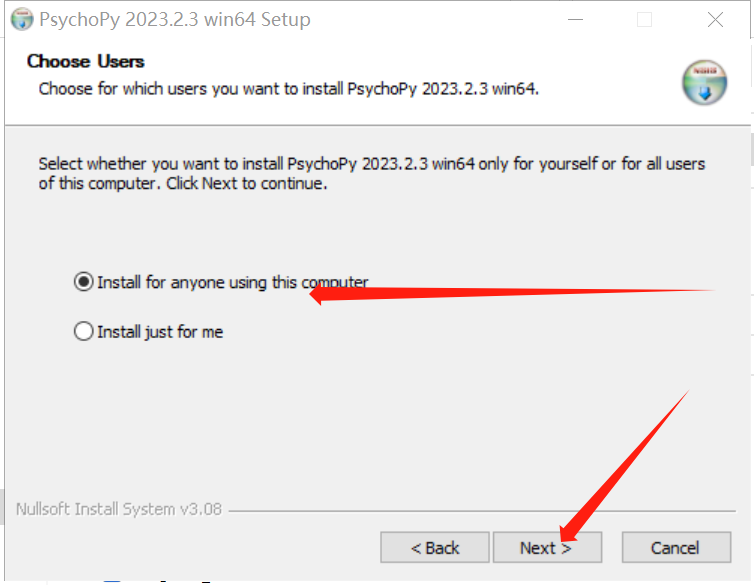

## 下载psychopy

首先打开[psychopy官网](https://www.psychopy.org/download.html)

点击**按钮**，下载最新版安装包

{}
不同系统可能看到的文字不一样
直接点击按钮下载即可
{}

## 安装psychopy

打开下载好的安装包

点击 "I Agree"

点击 "Next"

### 安装到其他盘符

{}
如果想安装到其他盘符，请先查看自己电脑有哪些盘符
{}

如这台电脑有C，D，E盘符，则可以安装这三个任意盘

如想安装到E盘，则把C改为E即可

点击 "Install"

安装完成！点击 "Close"关闭

## 将psychopy移动到桌面

按下Win键或直接点击

找到psychopy → 点击鼠标右键 → 更多 → 打开文件位置

找到psychopy → 点击鼠标右键 → 发送到 → 桌面快捷方式（Win10）

找到psychopy → 点击鼠标右键 → 显示更多选项 → 发送到 → 桌面快捷方式（Win11）

{}
至此，psychopy软件安装完成
{}
